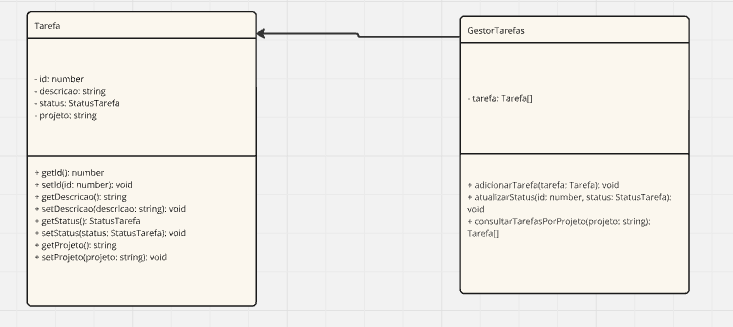

## Executar
1. Instale as dependências:

    ```bash
    npm install
    ```

2. Compile o código TypeScript:

    ```bash
    npx run dev
    ```
## Diagrama UML



## Teste

O sistema adiciona três tarefas ao gestor de tarefas: uma para "Estudar TypeScript" no "Projeto A", outra para "Desenvolver API" no "Projeto B" e uma terceira para "Testar funcionalidades" também no "Projeto A". Em seguida, atualiza o status da tarefa com ID 1 para "Concluída" e exibe uma confirmação no console. Depois, consulta todas as tarefas do "Projeto A" e imprime as informações no console, exibindo os detalhes de cada tarefa. Caso uma tarefa com o ID especificado não seja encontrada, o sistema exibe uma mensagem de erro.
